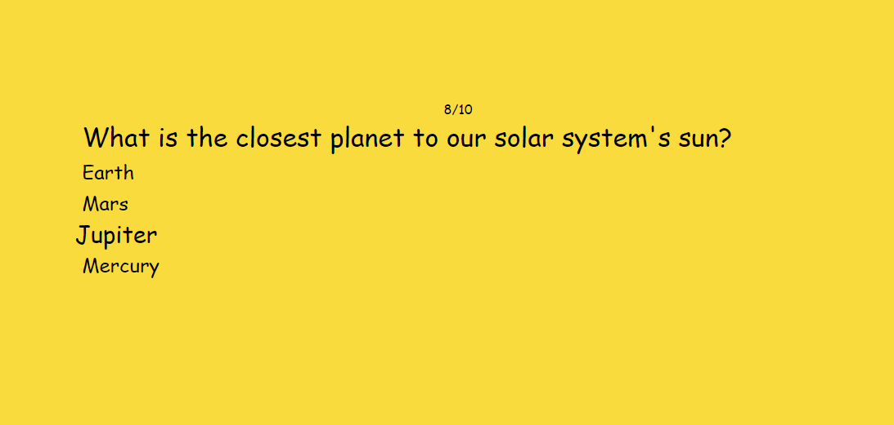

# Quiz ✅/❎

Test your knowledge by answering these general knowledge questions

# Motivation

This idea came out from [App Ideas Collection](https://github.com/florinpop17/app-ideas)  
See the project description [here](./PROJECT_IDEA.md)

# Screenshot



# Tools
* [React](https://es.reactjs.org/) - Library for UI
* [SASS](https://sass-lang.com/) - "CSS with superpowers"
* [Open Trivia Database](https://opentdb.com/api_config.php) - API that provides the questions
* [html-entities](https://www.npmjs.com/package/html-entities) - Decoding questions from API

# Deployment

This app is deployed on [Github Pages](https://oscaramos.github.io/Quiz/)

# To run this app
1. Clone this repo
2. Run ```npm install```
3. Run ```npm start```
